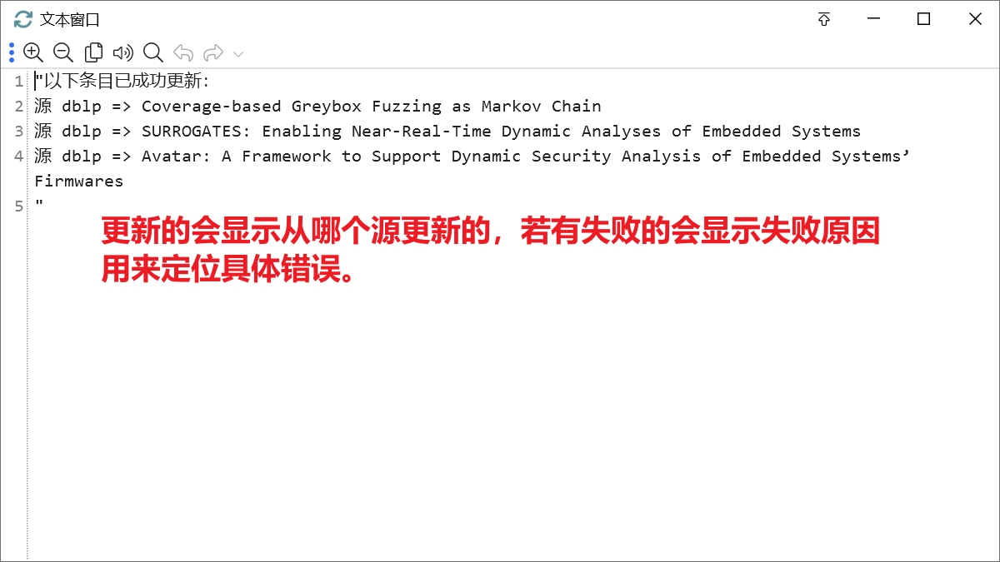
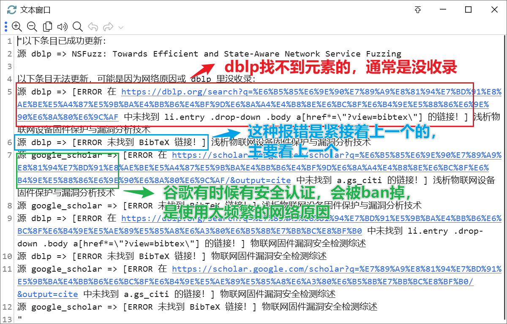

[中文简介](./README.md)

# Introduction

This is a JavaScript script that can run in Zotero. It is designed to automatically fetch and parse the first BibTeX entry from the dblp website when you select one or multiple items, and then use it to fill in the bibliographic information.

Here are two data safety statements:

1. To ensure data safety, if the type of entry obtained does not match the original type in Zotero, a new entry will be created, and relevant information, attachments, and tags will be copied over, but the original entry will not be deleted.
2. Except for directly overwriting the author and editor information, and not overwriting the title information, any other information will only be introduced from the BibTeX entry if the original data is empty, meaning it will not overwrite existing information.

# How to Use

## Without Quicker

1. Select the bibliographic items you want to fill in
2. Click "Tools"-"Developer"-"Run JavaScript"
3. Copy and paste the `main.js` code
4. Click the "Run" button in the upper left corner to run.

Consider making a UI and packaging it as a Zotero right-click plugin in the future.

## With Quicker

If you have Quicker, you can directly use the action I shared: [Click here to go to the portal~](https://getquicker.net/Sharedaction?code=e1553bba-54eb-41f0-2253-08dc1310ce90&fromMyShare=true)

You can directly view the introduction on the action page for the specific usage of Quicker.

> Also, if you are a new user, my invitation code is 970091-5834. After entering the invitation code, you can add three months of membership for each payment.

If success, the output is:

If something wrong, the output is:

Now the outputs are Chinese, because I am Chinese. Translating them is a heavy work for me, so I won't provide English until I start to write my right-click plugin.

# To-Do

- [x] Support more Bibtex source sites
  - [x] DBLP
  - [x] Google Scholar
- [x] Organize code, use Zotero's built-in BibTex parsing feature
- [ ] Refactor the code, using Zotero's database operations to streamline the process of copying entries
- [ ] Refactor the code, extract and design user-configurable options
- [ ] Develop a UI, to integrate it as a Zotero right-click option
- [ ] Package as an xpi plugin